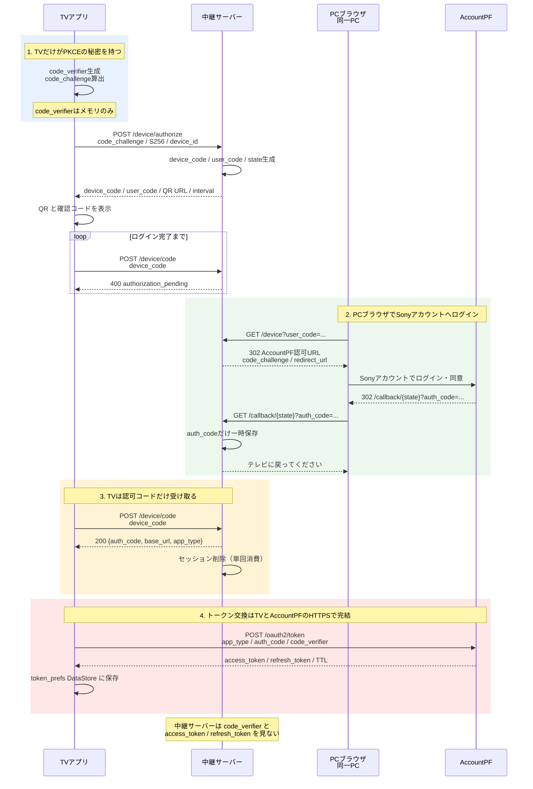
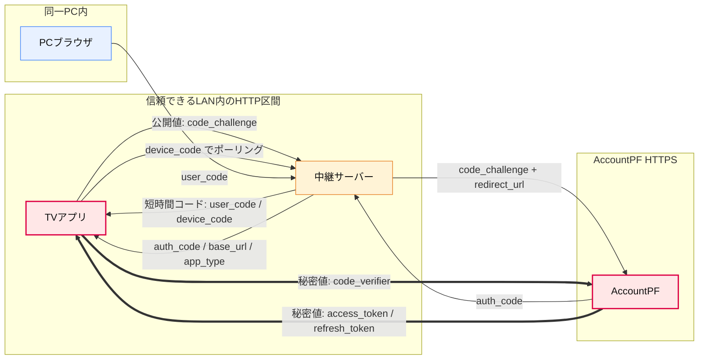

# 認証フロー（PKCE 擬似デバイスフロー）

TV に文字を入力させずに Creators' Cloud へログインするための仕組み。
2026-09-11 時点の実装と照合して記述する。

## 前提となる実測事実

AccountPF は RFC 8628 のデバイスフローを提供していない。以下は
[server/probe_oauth.py](../../server/probe_oauth.py) による実測（dev3, 2026-08-21）。

| # | 事実 | 効果 |
|---|---|---|
| 1 | `redirect_url` は `localhost` / `127.0.0.1` なら任意ポート・任意パスが許可される | 自前サーバーをコールバック先にできる。`state` をパスに埋められる |
| 2 | PKCE が強制される（`code_verifier` 無しのトークン交換は 401） | `auth_code` を中継しても、それだけではトークンにできない |

補足: 認可コードは `code=` ではなく **`auth_code=`** で返る。
`state` / `nonce` は AccountPF 自身が持つため、こちらが渡した任意の `state` が
コールバックへ引き継がれる保証がない。そのため `state` はリダイレクト先のパスに埋めている。

## 登場人物

| 役割 | 実体 |
|---|---|
| TV | Android TV アプリ（`Camera_tv/`） |
| 中継サーバー | ローカルの FastAPI（[server/device_flow.py](../../server/device_flow.py)） |
| ブラウザ | 中継サーバーと同じ PC のブラウザ |
| AccountPF | Sony の認可サーバー（`ws.dev3.imagingedge.sony.net`） |

> ブラウザをスマホにはできない。`redirect_url` が localhost 限定のため、
> スマホで開くとコールバックがスマホ自身へ戻ってしまい中継サーバーに届かない。

## シーケンス

全体を1枚で追えるよう、フェーズを色分けした1つのシーケンス図にする。
Mermaid の元図は [sequence_full.mmd](diagrams/sequence_full.mmd)。
draw.io / diagrams.net で編集したい場合は [sequence.drawio](diagrams/sequence.drawio) を開く。



**トークン交換は TV が直接行う。** 中継サーバーは `code_verifier` もトークンも見ない。

## データフロー

実装（2026-09-11 確認）では、秘密値の流れは次のようになる。
ポイントは **`code_verifier` とトークンが中継サーバー・ブラウザ・LAN HTTP を通らない**こと。

| # | データ | 生成元 | 通る経路 | 保持される場所 | セキュリティ上の意味 |
|---|---|---|---|---|---|
| 1 | `code_verifier` | TV（[Pkce.kt](../../Camera_tv/app/src/main/java/com/sony/dtv/camera_tv/data/remote/pairing/Pkce.kt)） | TV → AccountPF（HTTPS、トークン交換時のみ） | [AuthViewModel.kt](../../Camera_tv/app/src/main/java/com/sony/dtv/camera_tv/ui/auth/AuthViewModel.kt) の private フィールドのみ。成功時 / `onCleared()` で破棄 | 認可コードをトークン化する鍵。これがサーバーへ出ないため、サーバーや LAN 上の `auth_code` だけではトークン化できない |
| 2 | `code_challenge` | TV | TV → 中継サーバー（HTTP）→ ブラウザ → AccountPF | 中継サーバーのインメモリセッション | `code_verifier` の SHA-256。公開しても逆算困難なので中継してよい |
| 3 | `device_code` | 中継サーバー | 中継サーバー → TV（HTTP） / TV → 中継サーバー（HTTP、ポーリング） | TV メモリ、中継サーバーのインメモリセッション | TV のポーリング用セッション鍵。`auth_code` 返却時に単回消費される |
| 4 | `user_code` | 中継サーバー | 中継サーバー → TV（HTTP） / TV画面・サーバーログ・ブラウザURL | 中継サーバーのインメモリセッション | 人間がブラウザ操作を紐付けるための短時間コード。第三者に見せない |
| 5 | `state` | 中継サーバー | 中継サーバー → AccountPF（`redirect_url` のパス）→ 中継サーバー | 中継サーバーのインメモリセッション | AccountPF から戻った `auth_code` を元のTVセッションへ紐付ける |
| 6 | `auth_code` | AccountPF | AccountPF → ブラウザ → 中継サーバー（localhost callback）→ TV（HTTP） | 中継サーバーに一時保持。`/device/code` 返却時にセッション削除 | 単体ではトークン化できない。漏えい時の主な影響は認証妨害（DoS） |
| 7 | `access_token` / `refresh_token` | AccountPF | AccountPF → TV（HTTPS） | TV の `token_prefs` DataStore（[TokenPreferences.kt](../../Camera_tv/app/src/main/java/com/sony/dtv/camera_tv/data/local/TokenPreferences.kt)） | API 認証情報。中継サーバーとブラウザには渡らない |



## セキュリティ確認結果

2026-09-11 に [server/device_flow.py](../../server/device_flow.py)、[AuthViewModel.kt](../../Camera_tv/app/src/main/java/com/sony/dtv/camera_tv/ui/auth/AuthViewModel.kt)、[PairingApi.kt](../../Camera_tv/app/src/main/java/com/sony/dtv/camera_tv/data/remote/pairing/PairingApi.kt)、[TokenPreferences.kt](../../Camera_tv/app/src/main/java/com/sony/dtv/camera_tv/data/local/TokenPreferences.kt) を照合した結果、現在の実装は次の理由で「中継サーバーがトークンを取得できない」設計になっている。

| 確認項目 | 実装上の根拠 | 判定 |
|---|---|---|
| `code_verifier` を中継サーバーへ送らない | `/device/authorize` は `code_challenge` のみ、`/device/code` は `device_code` のみを受け取る | OK |
| トークン交換を中継サーバーで行わない | `/device/code` は `auth_code` / `base_url` / `app_type` を返すだけ。`exchangeToken` はTV側の Retrofit API | OK |
| トークンを中継サーバーに保存しない | `PairingTokens` はTVが受け取り、`TokenPreferences.saveAuthTokens()` で DataStore に保存 | OK |
| `auth_code` を単回消費する | `/device/code` 成功時に `store.delete(session.device_code)` を実行 | OK |
| `user_code` の総当たりを抑える | 8文字・20種のコードに加え、外部IPの失敗回数を `LookupThrottle` で制限 | OK |
| `callback` の表示で外部入力を直埋めしない | `_message_page()` で `html.escape()` を適用 | OK |

残る注意点はゼロではない。TV ⇔ 中継サーバーは HTTP 平文なので、信頼できる LAN 内で使う前提。
ただし平文に流れる `auth_code` は PKCE の鍵である `code_verifier` が無ければトークン化できない。
また、`user_code` を見た第三者が5分以内に先にログインすると、その第三者のアカウントがTVに紐付く。
このため、TV画面・サーバーコンソール・logcat のコードは扱いに注意する。

### 推奨対策

| リスク | 対策案 | 優先度 |
|---|---|---|
| `user_code` を見た第三者が先にログインする | TV画面に「表示コードを他人に見せない」を明記する。ブラウザ完了後、TV側にアカウント名の確認画面を出してから保存する案も検討する | 高 |
| サーバーコンソール / logcat に `user_code` と URL が出る | 詳細URLの出力を開発用途に限定する。release build では `AuthVM` のURLログを抑止し、共有ログでは `user_code` / `auth_code` をマスクする | 高 |
| TV ⇔ 中継サーバーが HTTP 平文 | 信頼できるLAN内だけで使う運用を明文化する。社外・共有ネットワークでは HTTPS 終端付きのトンネルまたはローカルHTTPS化を使う | 中 |
| `auth_code` 先取りによる認証妨害 | 現状はトークン漏えいには直結しないが、脅威モデルを広げる場合は `/device/code` に追加の確認値を入れる。例: TVが保持する nonce 由来の値をサーバーへ事前登録し、ポーリング時に照合する | 中 |
| 中継サーバーを公開ホストに置く | `LookupThrottle` のループバック除外やプロキシ越しIP判定を見直す。`X-Forwarded-For` を信用する場合は、信頼済みプロキシからの接続に限定する | 中 |

まず入れるべき現実的な対策は、ログ出力の制御、TV画面の注意文言、運用手順でのLAN限定明記。
HTTPS化や追加確認値は、ペアリングサーバーを共有ネットワークや公開ホストへ置く運用が必要になった時点で設計する。

## エンドポイント

| # | メソッド / パス | 呼ぶ人 | 実装 |
|---|---|---|---|
| 1 | `POST /device/authorize` | TV | [server/device_flow.py](../../server/device_flow.py) |
| 2 | `GET /device?user_code=` | ブラウザ | [server/device_flow.py](../../server/device_flow.py) |
| 3 | `GET /callback/{state}` | AccountPF | [server/device_flow.py](../../server/device_flow.py) |
| 4 | `POST /device/code` | TV | [server/device_flow.py](../../server/device_flow.py) |
| 5 | `POST {base_url}/api/v1/oauth2/token` | TV | [PairingApi.kt](../../Camera_tv/app/src/main/java/com/sony/dtv/camera_tv/data/remote/pairing/PairingApi.kt) |

## パラメーター定義

TV 側の型は [PairingDto.kt](../../Camera_tv/app/src/main/java/com/sony/dtv/camera_tv/data/remote/pairing/PairingDto.kt)、
サーバー側の型は [server/device_flow.py](../../server/device_flow.py) に定義がある。

### PKCE の 2 値（フロー全体の土台）

| パラメーター | 何のためか | 定義箇所 |
|---|---|---|
| `code_verifier` | ランダムな秘密。これを持つ者だけがトークンに交換できる。TV のメモリにしか存在しない | [Pkce.kt](../../Camera_tv/app/src/main/java/com/sony/dtv/camera_tv/data/remote/pairing/Pkce.kt) / [AuthViewModel.kt](../../Camera_tv/app/src/main/java/com/sony/dtv/camera_tv/ui/auth/AuthViewModel.kt) |
| `code_challenge` | `code_verifier` の SHA-256 を base64url したもの。公開しても逆算困難 | [Pkce.kt](../../Camera_tv/app/src/main/java/com/sony/dtv/camera_tv/data/remote/pairing/Pkce.kt) |
| `code_challenge_method` | 変換方式。`S256` 固定。`plain` はサーバーが拒否する | [PairingDto.kt](../../Camera_tv/app/src/main/java/com/sony/dtv/camera_tv/data/remote/pairing/PairingDto.kt) / [server/device_flow.py](../../server/device_flow.py) |

### 1. `POST /device/authorize`（TV → サーバー）

| パラメーター | 何のためか |
|---|---|
| `code_challenge` | ブラウザ経由で AccountPF へ引き渡す値。TV とトークンを結びつける錠前 |
| `code_challenge_method` | 上記の変換方式。`S256` 以外は `invalid_request` |
| `device_id` | AccountPF の認可リクエストに載せる端末識別子。既定 `camera-tv` |
| `device_code` | レスポンスで返る、TV だけが知るポーリング用セッション鍵 |
| `user_code` | レスポンスで返る、人が読む8文字コード。ブラウザ側がセッションを指定するために使う |
| `verification_uri_complete` | レスポンスで返る、`user_code` 入りのURL。QRに載せる |
| `expires_in` / `interval` | レスポンスで返る、セッションTTLと推奨ポーリング間隔 |

### 2. `GET /device?user_code=`（ブラウザ → サーバー → AccountPF）

| パラメーター | 何のためか |
|---|---|
| `user_code` | ブラウザ操作をTVのセッションへ紐付ける |
| `redirect_url` | ログイン後の戻り先。`{REDIRECT_BASE_URL}/callback/{state}` 固定 |
| `app_type` | AccountPF 上のアプリ種別。認可時と交換時で一致させる（`DEVICE_APP_TYPE`） |
| `code_challenge` | TV から預かった値をそのまま転送する |
| `state` | セッション識別子。クエリではなくリダイレクト先パスへ埋める |

### 3. `GET /callback/{state}`（AccountPF → サーバー）

| パラメーター | 何のためか |
|---|---|
| `state`（パス） | どの TV セッションへの応答かを引き当てる |
| `auth_code` | 認可コード。サーバーは保持するだけでトークン交換しない |
| `error` | ユーザーキャンセル時の理由。画面に出す前に `html.escape()` する |

### 4. `POST /device/code`（TV → サーバー）

| パラメーター | 何のためか |
|---|---|
| `device_code` | 自分のセッションを指す。`code_verifier` はここでは送らない |
| `auth_code` | レスポンスで返る認可コード。返却と同時にセッションを破棄する |
| `base_url` | 次に TV が叩く AccountPF のホスト |
| `app_type` | ステップ2で使った値と同じもの |

### 5. `POST {base_url}/api/v1/oauth2/token`（TV → AccountPF）

| パラメーター | 何のためか |
|---|---|
| `app_type` | 認可時と同一であることの確認 |
| `auth_code` | ステップ4で受け取った認可コード |
| `code_verifier` | `code_challenge` に対する鍵。TV のメモリからのみ供給される |
| `access_token` / `refresh_token` | レスポンスで返るAPI認証情報。TVのDataStoreに保存する |

## ステップ詳細

1. TV が [Pkce.kt](../../Camera_tv/app/src/main/java/com/sony/dtv/camera_tv/data/remote/pairing/Pkce.kt) で `code_verifier` と `code_challenge` を生成する。
2. [AuthViewModel.kt](../../Camera_tv/app/src/main/java/com/sony/dtv/camera_tv/ui/auth/AuthViewModel.kt) が [server/device_flow.py](../../server/device_flow.py) の `/device/authorize` を呼ぶ。
3. サーバーは `device_code`、`user_code`、`state` をインメモリで発行する。
4. [AuthScreen.kt](../../Camera_tv/app/src/main/java/com/sony/dtv/camera_tv/ui/auth/AuthScreen.kt) がQRと確認コードを表示し、TVは `/device/code` をポーリングする。
5. PCブラウザが `/device?user_code=...` を開くと、サーバーは AccountPF の認可URLへリダイレクトする。
6. AccountPF は `/callback/{state}?auth_code=...` へ戻す。サーバーは `auth_code` だけを一時保存する。
7. TVが次回 `/device/code` を呼ぶと、サーバーは `auth_code` / `base_url` / `app_type` を返し、セッションを削除する。
8. TV が [PairingApi.kt](../../Camera_tv/app/src/main/java/com/sony/dtv/camera_tv/data/remote/pairing/PairingApi.kt) の `exchangeToken()` で AccountPF へ直接トークン交換する。
9. [TokenPreferences.kt](../../Camera_tv/app/src/main/java/com/sony/dtv/camera_tv/data/local/TokenPreferences.kt) がトークンを `token_prefs` DataStore へ保存する。
10. [MainActivity.kt](../../Camera_tv/app/src/main/java/com/sony/dtv/camera_tv/MainActivity.kt) の認証ゲートが `refreshToken` の更新を見て写真画面へ遷移する。

## エラー応答（RFC 8628 に倣う）

`POST /device/code` は未完了時 HTTP 400 + JSON で返す。

| `error` | 意味 | TV の挙動 |
|---|---|---|
| `authorization_pending` | まだログインしていない | ポーリング継続 |
| `slow_down` | ポーリングが速すぎる | 間隔を +2 秒して継続 |
| `expired_token` | セッション期限切れ | 中止して再試行を促す |
| `access_denied` | `device_code` が無効／消費済み | 中止して再試行を促す |

## 総当たり対策

`user_code` は 8 文字 × 20 種＝約 $2.6 \times 10^{10}$ 通り。加えて `GET /device` の失敗を
クライアント IP ごとに数え、`MAX_LOOKUP_FAILURES` を超えたら一時的に 429 を返す。

ループバックは対象外。`/device` を叩くのはサーバーと同じ PC のブラウザだけなので、そこを止めても防げる相手がいない。
逆に検証スクリプトや入力ミスで操作者自身が締め出される。

> 逆プロキシを前段に置く構成では遠隔からの接続もループバックに見えるため、`_is_loopback` の判定を見直すこと。

## 設定

| 項目 | 既定値 | 場所 |
|---|---|---|
| `PUBLIC_BASE_URL` | `http://localhost:8000` | [server/config.py](../../server/config.py) |
| `REDIRECT_BASE_URL` | `http://localhost:8000` | [server/config.py](../../server/config.py) |
| `SESSION_TTL_SEC` | 300 | [server/config.py](../../server/config.py) |
| `POLL_INTERVAL_SEC` | 3 | [server/config.py](../../server/config.py) |
| `DEVICE_APP_TYPE` | `_trial_` | [server/config.py](../../server/config.py) |
| `MAX_ACTIVE_SESSIONS` | 200 | [server/config.py](../../server/config.py) |
| `MAX_LOOKUP_FAILURES` / `LOOKUP_BLOCK_SEC` | 10 / 300 | [server/config.py](../../server/config.py) |

`REDIRECT_BASE_URL` は **localhost / 127.0.0.1 のままにすること**。
それ以外は AccountPF に `400 Invalid redirectUrl` で拒否される。

TV 側の接続先は `Camera_tv/local.properties`（git 管理外）の `pairing.serverUrl`。
`BuildConfig.PAIRING_SERVER_URL` として埋め込まれるため、変更後は再ビルド・再インストールが必要。

## 認証後のトークン更新

以降の API 呼び出しは [AuthInterceptor.kt](../../Camera_tv/app/src/main/java/com/sony/dtv/camera_tv/data/remote/AuthInterceptor.kt) が Bearer を付け、期限切れなら自動で更新する。
`refresh_token` は使い切りで、期限切れなら再ログインが必要。詳細は [spec.md](spec.md) を参照。

## サインアウト

トークンは `token_prefs` DataStore にある。`local.properties` の `dev.accessToken` を空にしてもサインアウトにならない。
メニュー「サインアウト」または `adb shell pm clear com.sony.dtv.camera_tv` で消す。

## 動作確認

```powershell
# サーバー起動（LAN IP と貼る行を表示する）
.\server\start_pairing_server.bat

# ログイン不要の自己診断
.\.venv\Scripts\python.exe server\test_device_flow.py

# ブラウザログインを含む通し確認
.\.venv\Scripts\python.exe server\test_device_flow.py e2e
```

TV が繋がらないときは、まず `pairing.serverUrl` の IP を疑うこと。
DHCP で変わり、症状はファイアウォール遮断と見分けがつかない。
