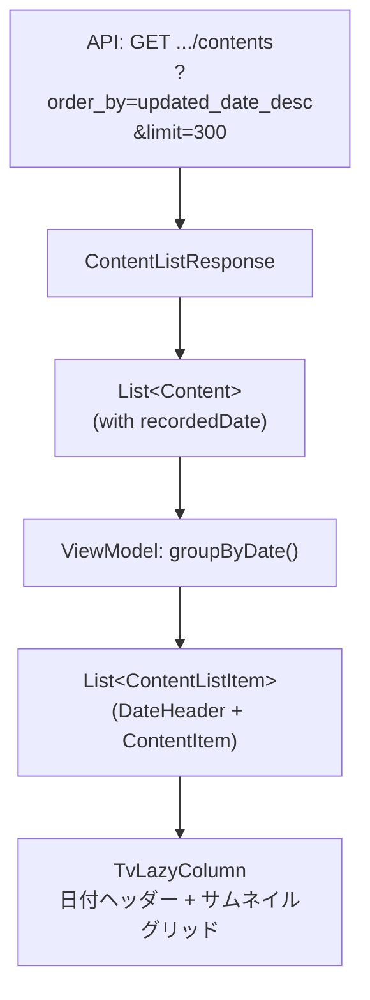

# コンテンツ日付別グルーピング設計

## 概要

TVアプリのスライドショー/コンテンツ一覧画面において、コンテンツを撮影日付ごとにグルーピングして表示する。

## APIから取得する日付情報

`GET /api/v1/folders/{folder_id}/contents` のレスポンスに含まれる日付フィールド:

| フィールド | 形式 | 説明 |
|---|---|---|
| `recorded_date` | `YYYY-MM-DD'T'hh:mm:ss.SSSxxx` | 撮影日時（サーバーがExifから自動解析） |
| `recorded_date_local_time` | `YYYY-MM-DDThh:mm:ss.SSS` | offset取得不可時のローカル日時 |
| `created_date` | `YYYY-MM-DDThh:mm:ss.SSSZ` | サーバー登録日時（UTC） |
| `updated_date` | `YYYY-MM-DDThh:mm:ss.SSSZ` | 更新日時（UTC） |

**日付優先度**: `recorded_date` → `recorded_date_local_time` → `created_date`

## 変更対象ファイル

```
data/model/Content.kt          ← recordedDate等フィールド追加
data/remote/ImagingEdgeApi.kt   ← クエリパラメータ追加
data/remote/dto/ContentListResponse.kt ← last_item追加
ui/slideshow/SlideshowViewModel.kt     ← グルーピングロジック追加
ui/slideshow/SlideshowScreen.kt        ← 日付ヘッダー付きリスト表示
```

## データモデル変更

### Content.kt

```kotlin
data class Content(
    @SerializedName("content_id") val contentId: String,
    @SerializedName("display_name") val displayName: String,
    @SerializedName("filename") val filename: String? = null,
    @SerializedName("recorded_date") val recordedDate: String? = null,
    @SerializedName("recorded_date_local_time") val recordedDateLocalTime: String? = null,
    @SerializedName("created_date") val createdDate: String? = null,
)
```

### ContentListResponse.kt

```kotlin
data class ContentListResponse(
    @SerializedName("contents") val contents: List<Content> = emptyList(),
    @SerializedName("last_item") val lastItem: String? = null,
)
```

## UIモデル

```kotlin
package com.sony.dtv.camera_tv.ui.slideshow

import com.sony.dtv.camera_tv.data.model.Content
import java.time.LocalDate

sealed class ContentListItem {
    data class DateHeader(val date: LocalDate, val label: String) : ContentListItem()
    data class ContentItem(val content: Content) : ContentListItem()
}
```

## API呼び出し変更

```kotlin
@GET("api/v1/folders/{folderId}/contents")
suspend fun listContents(
    @Path("folderId") folderId: String,
    @Query("order_by") orderBy: String = "updated_date_desc",
    @Query("limit") limit: Int = 300,
    @Query("start_from") startFrom: String? = null,
): Response<ContentListResponse>
```

## グルーピングロジック（ViewModel）

```kotlin
import java.time.LocalDate
import java.time.OffsetDateTime
import java.time.LocalDateTime
import java.time.format.DateTimeFormatter

private fun groupByDate(contents: List<Content>): List<ContentListItem> {
    val displayFormatter = DateTimeFormatter.ofPattern("yyyy年M月d日")

    return contents
        .sortedByDescending { extractDate(it)?.toEpochDay() ?: Long.MIN_VALUE }
        .groupBy { extractDate(it) }
        .flatMap { (date, items) ->
            val header = ContentListItem.DateHeader(
                date = date ?: LocalDate.MIN,
                label = date?.format(displayFormatter) ?: "日付不明"
            )
            listOf(header) + items.map { ContentListItem.ContentItem(it) }
        }
}

private fun extractDate(content: Content): LocalDate? {
    // 優先度: recorded_date > recorded_date_local_time > created_date
    content.recordedDate?.let {
        return try {
            OffsetDateTime.parse(it).toLocalDate()
        } catch (_: Exception) { null }
    }
    content.recordedDateLocalTime?.let {
        return try {
            LocalDateTime.parse(it).toLocalDate()
        } catch (_: Exception) { null }
    }
    content.createdDate?.let {
        return try {
            OffsetDateTime.parse(it).toLocalDate()
        } catch (_: Exception) { null }
    }
    return null
}
```

## UiState変更

```kotlin
data class SlideshowUiState(
    val isLoading: Boolean = false,
    val contents: List<Content> = emptyList(),
    val groupedItems: List<ContentListItem> = emptyList(),  // 追加
    val currentIndex: Int = 0,
    val isPlaying: Boolean = true,
    val thumbnailUrl: String? = null,
    val accessToken: String = "",
    val error: String? = null,
)
```

## UI層（Compose for TV）

```kotlin
@Composable
fun ContentGridWithDateHeaders(
    groupedItems: List<ContentListItem>,
    onContentClick: (Content) -> Unit,
    modifier: Modifier = Modifier,
) {
    TvLazyColumn(modifier = modifier) {
        items(groupedItems) { item ->
            when (item) {
                is ContentListItem.DateHeader -> {
                    Text(
                        text = item.label,
                        style = MaterialTheme.typography.titleMedium,
                        color = MaterialTheme.colorScheme.onSurface,
                        modifier = Modifier
                            .fillMaxWidth()
                            .padding(horizontal = 24.dp, vertical = 12.dp)
                    )
                }
                is ContentListItem.ContentItem -> {
                    ContentThumbnailCard(
                        content = item.content,
                        onClick = { onContentClick(item.content) },
                    )
                }
            }
        }
    }
}
```

> **TV対応**: `TvLazyColumn` を使用し、D-Padフォーカス移動に対応。DateHeaderはフォーカス不可とし、ContentItemのみフォーカス可能にする。

## データフロー



## ページネーション

- 1回のAPI呼び出しで最大300件
- `last_item` がレスポンスに含まれる場合、追加コンテンツあり
- 画面下部到達時に `start_from=last_item` で次ページ取得
- 既存の `groupedItems` に追記マージ

```kotlin
fun loadMoreContents() {
    val lastItem = currentLastItem ?: return
    scope.launch {
        repository.listContents(folderId, startFrom = lastItem)
            .onSuccess { response ->
                val newContents = _uiState.value.contents + response.contents
                currentLastItem = response.lastItem
                _uiState.update {
                    it.copy(
                        contents = newContents,
                        groupedItems = groupByDate(newContents),
                    )
                }
            }
    }
}
```

## 注意事項

- `recorded_date` はExifから自動抽出されるため、動画やExifのないファイルでは `null` の可能性あり
- タイムゾーンは端末のデフォルトではなく、`recorded_date` のoffset（撮影地のTZ）をそのまま使用
- グルーピングは端末のローカル日付ではなく、撮影日のローカル日付で行う
- サーバーの `order_by` はコンテンツ単位のソートのみで、日付グルーピングはクライアント側で実施
