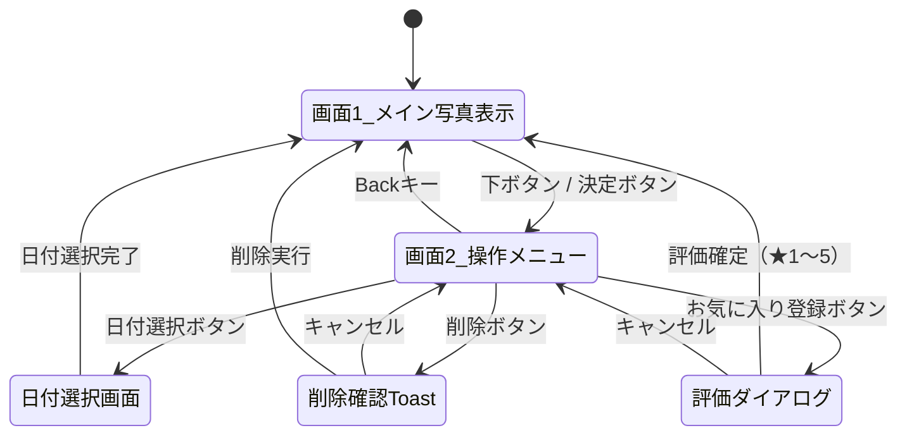

# TVアプリ 画面遷移・UI設計

## 画面構成

### 画面1: メイン写真表示画面（初期画面）

最新の日付グループの写真をフルスクリーンで表示する。

- 起動時に最新の撮影日のコンテンツを自動表示
- 左右ボタンで同一日付グループ内の写真を切り替え
- **下ボタン or 決定ボタン** → 画面2（操作メニュー）を表示

### 画面2: 操作メニュー（オーバーレイ）

画面1の上にオーバーレイ表示されるメニューバー。

| ボタン | 動作 |
|---|---|
| 日付選択 | 日付選択画面へ遷移 |
| お気に入り登録 | 5段階評価ダイアログを表示し、現在の写真に評価（★1〜5）を設定 |
| 削除 | 削除確認Toastを表示 |
| 共有 | ダウンロードURLをQRコード化して表示 |

- **Backキー** → 画面1に戻る（メニュー非表示）

### お気に入り（5段階評価）ダイアログ

- 「お気に入り登録」ボタン押下時にオーバーレイ表示
- ★1〜5から評価を選択し、Imaging Edge API の TAG（`rating:N` 形式）としてサーバーに保存
- 高評価（★4以上）のコンテンツのみをフィルタ表示する機能も提供

### 日付選択画面

- 日付ごとにグルーピングされたコンテンツ一覧を表示
- 日付を選択すると画面1に戻り、選択した日付グループの写真を表示

### 削除確認Toast

- 削除ボタン押下時にToastメッセージを表示
- 確認後、対象コンテンツを削除

### クラウドへの取り込み案内（2026-09-11 追加 / 2026-09-14 改訂）

`ui/common/CloudUploadGuide.kt` ＋ `ui/common/YouTubeLauncher.kt`。
カメラから直接クラウドへアップロードする設定手順
（[ソニー サポート](https://support.sony.jp/electronics/support/articles/00353042)）へ誘導する。

**実測（2026-09-14）**: このページの解説動画は **YouTube 埋め込み**。
`<iframe src="https://www.youtube.com/embed/4O1MxhklXNA?rel=0&showinfo=0">`。
`.mp4` / `m3u8` / Brightcove の参照は無し。

導線は 2 本。

| 導線 | 内容 |
|---|---|
| 「TVで動画を見る」ボタン | **アプリ内で再生**（`ui/common/HelpVideoOverlay.kt`）。公式の IFrame Player API を WebView で動かす |
| QR コード | 手順を手元に置きたいとき用。ページ全体（テキスト版含む）をスマートフォンで開く |

**YouTube アプリへ Intent で飛ばす方式は既定から外した（2026-09-15）。**
実機で YouTube アプリがサインインを要求し、動画を見るだけなのにログインが必要になったため。
埋め込みプレイヤーならサインイン不要で再生できる。Intent は WebView が使えない TV 用の
フォールバックとしてのみ残す（`YouTubeLauncher`）。

**自前プレイヤーでストリームを再生してはいけない。** 埋め込みプレイヤー以外での再生は
YouTube の規約違反。IFrame Player API はその埋め込みそのものなので規約内。
media3/ExoPlayer は依存に足していない。

`HelpVideoOverlay` の作り:

- **埋め込み元として名乗る origin に `https://www.youtube.com` を使ってはいけない。**
  自己埋め込み扱いになり **`player error 152`** で再生されない
  （2026-09-15 BRAVIA_4K_AE3 実機で確認。`onError` で 152 、`origin=https://www.youtube.com`）。
  `EMBED_ORIGIN = "https://appassets.androidplatform.net"`（AndroidX が WebView のローカル配信用に
  予約している名前）に変えると `state 1`（PLAYING）になることを同日実測。
- `EMBED_ORIGIN` は名乗るだけで実在しない。favicon を取りに行かせると毎回
  `ERR_NAME_NOT_RESOLVED` になるので、`shouldInterceptRequest` で空を返して止める
- `mediaPlaybackRequiresUserGesture = false` — TV には「タップ」に相当する操作が無いので
  これを切らないと自動再生が始まらない
- WebView は `isFocusable = false`。フォーカスを取られるとキーが戻ってこない。
  リモコン操作は上に載せた `KeyInputSurface` から `evaluateJavascript` で JS を呼ぶ
  （決定 = 再生／一時停止、← → = 10 秒送り戻し、戻る = 閉じる）
- **プレイヤーの console と `onError` は必ず logcat へ流す（tag `HelpVideoOverlay`）。**
  再生されない原因は JS 側にしか現れず、これが無いと全く切り分けられない
- 動画 ID は `^[A-Za-z0-9_-]{11}$` で検証してから JS に埋め込む（スクリプト注入対策）
- **再生中は呼び出し元を early return して描かない。** `KeyInputSurface` が 2 つ同時に
  出るとフォーカスを奪い合う（`TutorialIntro` と同じ理由）

出す場所は 2 か所。

| 場所 | 表示 |
|---|---|
| 写真が 0 枚のとき（`EmptyState`） | QR 通常版 ＋「再読み込み」「TVで動画を見る」。← → で選び 決定 で実行 |
| 使い方案内の導入カード（`TutorialIntro`） | QR は `compact = true`（96dp、URL 行なし）。ボタンは「案内をはじめる」「TVで動画を見る」「スキップ」の 3 択 |

`<queries>` 宣言は `YouTubeLauncher.canOpen()` のために引き続き必要
（targetSdk 35 のパッケージ可視性制限。無いと `resolveActivity` が常に null）。

QR は既存の `ui/common/QrCode.generateQrBitmap`（ZXing core、純 Java）で作るため追加依存はゼロ。
読めない環境でも辿れるよう、通常版は URL も文字で併記する。

### 使い方案内（2026-08-26 改訂）

読ませる説明をやめ、**実際の画面で 1 手順ずつ操作してもらう**方式にした。
文章 5 ページを読ませても操作は覚えられず、読み飛ばされるだけだったため。

構成は 2 段階。

1. **導入カード**（`ui/tutorial/TutorialIntro.kt`）
   全画面のカードで「案内をはじめる」「スキップ」を選ばせる。
   ここだけが唯一キー入力を奪う。どちらを選んでも既読として保存する
   （途中で落ちても初回案内が再発しないようにするため）。
2. **実画面ガイド**（`ui/tutorial/TutorialCoachOverlay.kt`）
   通常画面の右端に「次にやること」を出す。**キー入力を一切奪わない**。
   進行は押されたキーではなく `CoachSignal`（表示中の写真・選別中か・拡大中か・
   判定済み枚数）の変化で判定する。押しただけで何も起きていないときに
   先へ進まないようにするため。

手順は実際の選別作業の流れに合わせてある。

| 手順 | 案内 | 達成条件 |
|---|---|---|
| 1 | 写真を送る | 表示中の写真が変わる |
| 2 | メニューから選別を始める | 選別中になる |
| 3 | 決定で拡大してピントを見る | 拡大状態になる |
| 4 | ↑ 採用 / ↓ 見送り | 判定済み枚数が増える |
| — | 締めくくり | 5 秒後に自動で閉じる |

メニュー「使い方」からいつでも導入カードに戻れる。

## 画面遷移図

## 操作マッピング（リモコン）

| 画面 | キー | 動作 |
|---|---|---|
| 画面1 | ← / → | 同一日付グループ内の写真切替 |
| 画面1 | ↓ / 決定 | 操作メニュー表示 |
| 画面2 | ← / → | メニューボタン間フォーカス移動 |
| 画面2 | 決定 | 選択中のボタン実行 |
| 画面2 | Back | 画面1に戻る |
| 日付選択 | ↑ / ↓ | 日付リストのフォーカス移動 |
| 日付選択 | 決定 | 日付確定 → 画面1へ |
| 日付選択 | Back | 画面2に戻る |

### 見比べ画面（`CompareScreen`）

選別中に CH+ で入る。下の帯でチェックした写真を「重ね」または「並べ」で見比べる。

**同じ個所の同時拡大**（2026-09-11 追加）。連写のピントを比べる用途。
倍率と見る位置は全枚で共有する 1 組の値（`zoomStep` / `zoomCenterX` / `zoomCenterY`）で、
選別画面の拡大とまったく同じ仕組み（`rememberZoomedRegion` → `BitmapRegionDecoder`）を使う。
位置は元画像全体に対する割合なので、画素数が同じ連写なら全枚で同じ被写体の同じ個所が並ぶ。
原寸はチェック中の写真の分だけ保持し、外した写真の分は捨てる（1 枚で数十 MB あるため）。

| 状態 | キー | 動作 |
|---|---|---|
| 通常 | ← / → | 候補の移動 |
| 通常 | 決定 | 見比べに含めるかを切替 |
| 通常 | CH+ | 重ね ⇄ 並べ |
| 通常 | CH− | 拡大開始 |
| 通常 | ↑ / ↓ | 採用 / 見送り |
| 通常 | Back | 見比べ終了 |
| 拡大中 | ← / → / ↑ / ↓ | 全枚の見る位置を移動 |
| 拡大中 | 決定 / CH− | 倍率変更（等倍 → 200% → 400% → 解除） |
| 拡大中 | CH+ | 重ね ⇄ 並べ |
| 拡大中 | Back | 拡大を解除 |
