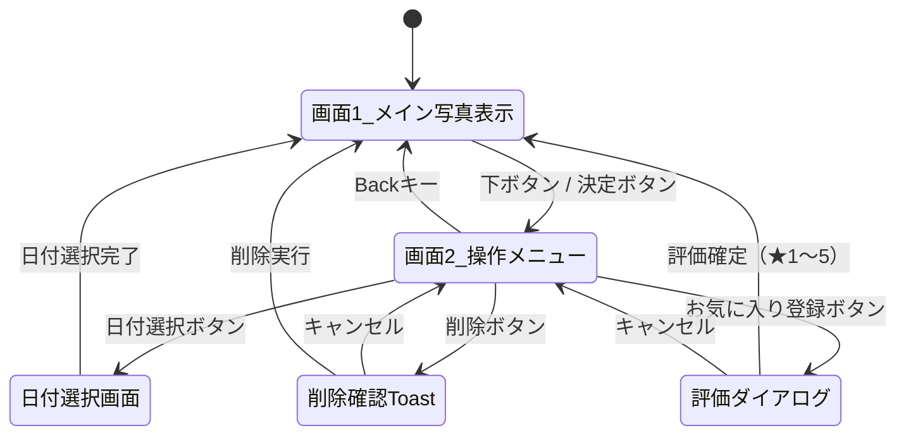

# TVアプリ 画面遷移・UI設計

## 画面構成

### 画面1: メイン写真表示画面（初期画面）

最新の日付グループの写真をフルスクリーンで表示する。

- 起動時に最新の撮影日のコンテンツを自動表示
- 左右ボタンで同一日付グループ内の写真を切り替え
- **下ボタン or 決定ボタン** → 画面2（操作メニュー）を表示

### 画面2: 操作メニュー（オーバーレイ）

画面1の上にオーバーレイ表示されるメニューバー。

| ボタン | 動作 |
|---|---|
| 日付選択 | 日付選択画面へ遷移 |
| お気に入り登録 | 5段階評価ダイアログを表示し、現在の写真に評価（★1〜5）を設定 |
| 削除 | 削除確認Toastを表示 |
| 共有 | ダウンロードURLをQRコード化して表示 |

- **Backキー** → 画面1に戻る（メニュー非表示）

### お気に入り（5段階評価）ダイアログ

- 「お気に入り登録」ボタン押下時にオーバーレイ表示
- ★1〜5から評価を選択し、Imaging Edge API の TAG（`rating:N` 形式）としてサーバーに保存
- 高評価（★4以上）のコンテンツのみをフィルタ表示する機能も提供

### 日付選択画面

- 日付ごとにグルーピングされたコンテンツ一覧を表示
- 日付を選択すると画面1に戻り、選択した日付グループの写真を表示

### 削除確認Toast

- 削除ボタン押下時にToastメッセージを表示
- 確認後、対象コンテンツを削除

### 使い方案内（2026-08-26 改訂）

読ませる説明をやめ、**実際の画面で 1 手順ずつ操作してもらう**方式にした。
文章 5 ページを読ませても操作は覚えられず、読み飛ばされるだけだったため。

構成は 2 段階。

1. **導入カード**（`ui/tutorial/TutorialIntro.kt`）
   全画面のカードで「案内をはじめる」「スキップ」を選ばせる。
   ここだけが唯一キー入力を奪う。どちらを選んでも既読として保存する
   （途中で落ちても初回案内が再発しないようにするため）。
2. **実画面ガイド**（`ui/tutorial/TutorialCoachOverlay.kt`）
   通常画面の右端に「次にやること」を出す。**キー入力を一切奪わない**。
   進行は押されたキーではなく `CoachSignal`（表示中の写真・選別中か・拡大中か・
   判定済み枚数）の変化で判定する。押しただけで何も起きていないときに
   先へ進まないようにするため。

手順は実際の選別作業の流れに合わせてある。

| 手順 | 案内 | 達成条件 |
|---|---|---|
| 1 | 写真を送る | 表示中の写真が変わる |
| 2 | メニューから選別を始める | 選別中になる |
| 3 | 決定で拡大してピントを見る | 拡大状態になる |
| 4 | ↑ 採用 / ↓ 見送り | 判定済み枚数が増える |
| — | 締めくくり | 5 秒後に自動で閉じる |

メニュー「使い方」からいつでも導入カードに戻れる。

## 画面遷移図

## 操作マッピング（リモコン）

| 画面 | キー | 動作 |
|---|---|---|
| 画面1 | ← / → | 同一日付グループ内の写真切替 |
| 画面1 | ↓ / 決定 | 操作メニュー表示 |
| 画面2 | ← / → | メニューボタン間フォーカス移動 |
| 画面2 | 決定 | 選択中のボタン実行 |
| 画面2 | Back | 画面1に戻る |
| 日付選択 | ↑ / ↓ | 日付リストのフォーカス移動 |
| 日付選択 | 決定 | 日付確定 → 画面1へ |
| 日付選択 | Back | 画面2に戻る |
